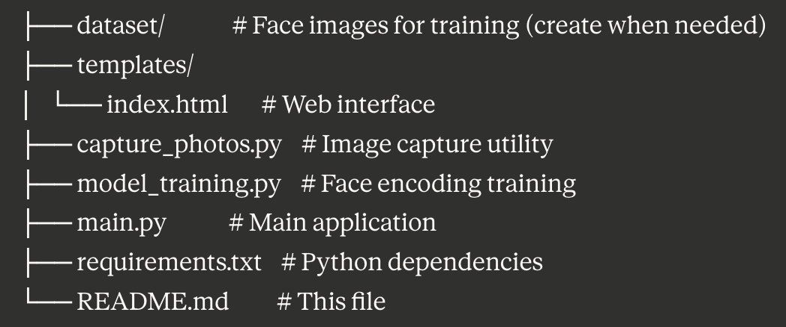
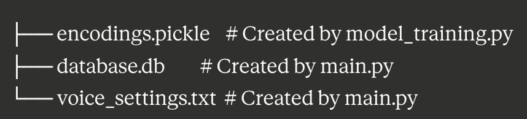
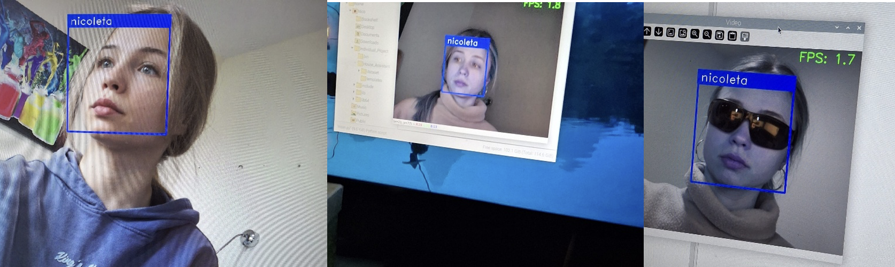
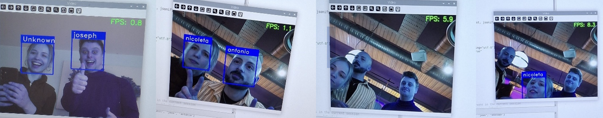

# AI House Assistant: Face Recognition System for Visually Impaired Users

A low-cost, AI-powered face recognition system built with Raspberry Pi 4 to help visually impaired individuals identify visitors at their doorstep through audio feedback.


## 🎯 Project Overview

This assistive technology project was developed as part of my BEng Computer Engineering course at the University of Greenwich. It combines face recognition, text-to-speech alerts, and a web-based monitoring interface to create an accessible solution for visually impaired users.

### Key Features

- **Real-time Face Recognition**: 85% accuracy in detecting and identifying known individuals
- **Audio Feedback**: Text-to-speech announcements for visitor identification
- **Web Dashboard**: Flask-based interface for monitoring visitor logs
- **Database Logging**: SQLite database tracking all detections with timestamps
- **Low-Cost Solution**: Total hardware cost under £100
- **Session Management**: Smart detection system with 10-second timeout

## 🛠️ Technologies Used

**Hardware:**
- Raspberry Pi 4 Model B (4GB RAM)
- Raspberry Pi Camera Module 3 (12MP)
- MicroSD Card (128GB)

**Software Stack:**
- Python 3.9
- OpenCV 11.0.86 - Face detection using Haar cascades
- dlib 19.24.6 - Face landmark detection
- face_recognition 1.3.0 - Face encoding and matching
- Picamera2 - Camera interface
- Flask - Web interface
- SQLite3 - Database management
- NumPy - Array operations

## 📊 Performance Metrics

- **Recognition Accuracy**: 85% in controlled indoor environments
- **Processing Speed**: 1.6 FPS (single face), 0.95 FPS (two faces)
- **Detection Distance**: Up to 1.5 meters (configurable)
- **Logging Accuracy**: 100% successful database entries
- **TTS Clarity**: 100% in successful trials

## 🚀 Installation & Setup

### Prerequisites
```bash
# Update system
sudo apt-get update
sudo apt-get upgrade

# Install system dependencies
sudo apt-get install python3-pip python3-dev
sudo apt-get install libatlas-base-dev libjasper-dev libqt4-test
```

### Installation Steps

1. **Clone the repository**
```bash
git clone https://github.com/NicoletaRusnac/ai-house-assistant-fr.git
cd ai-house-assistant-fr
```

2. **Create virtual environment**
```bash
python3 -m venv env
source env/bin/activate
```

3. **Install Python packages**
```bash
# Using python3 -m pip ensures you're using the correct pip from your virtual environment
python3 -m pip install -r requirements.txt
```

4. **Project structure will be:**


<div style="position:relative; left:0; margin:20px 0;">
<p>ai-house-assistant-fr/</p>
    
</div>

<div style="position:relative; left:0; margin:20px 0;">
<p>Auto-generated files (not in repo): </p>
    
</div>

## 📖 Usage Guide

### 1. Capture Training Images
```bash
# Edit capture_photos.py first to set the person's name
# Change: PERSON_NAME = "nicoleta" to the actual person's name

python capture_photos.py
```
- Press `SPACE` to capture images
- Press `Q` to exit
- Minimum 10 images per person recommended
- Creates `dataset/[name]/` folder automatically

### 2. Train the Model
```bash
python model_training.py
```
This creates `encodings.pickle` with face encodings from all people in the dataset folder.

### 3. Run the System
```bash
python main.py
```
- Video feed displays on monitor
- Web interface accessible at `http://[raspberry-pi-ip]:5000`
- Press `Q` in video window to exit

### 4. Access Web Dashboard

Open browser and navigate to: http://192.168.x.x:5000
(Replace with your Raspberry Pi's actual IP address)

**Dashboard Features:**
- Latest recognized person display
- Visitor logbook (last 10 entries)
- Voice notification toggle
- Manual face scan trigger

## 🔧 Configuration

### Adjust Detection Distance

In `main.py`, modify the scaler variable:
```python
cv_scaler = 4  # Increase for longer distance detection
```

### Face Recognition Tolerance

In `main.py`, adjust tolerance (lower = stricter):
```python
tolerance=0.6  # Recommended range: 0.4-0.7
```

### Session Timeout

In `main.py`, change timeout duration:
```python
NO_FACE_TIMEOUT = 10  # Seconds before session reset
```
<div align="center">

## 🧪 Testing Results
</div>

<div align="center">

### Accuracy in Different Conditions
</div>

<div align="center">

| Condition | Accuracy | Detection Time |
|:---------:|:--------:|:--------------:|
| Normal Lighting | 100% | 1 second |
| Low Light | 75% | 1-1.5 seconds |
| With Sunglasses | 100% | 1 second |
| 30° Angle | 100% | 1-1.5 seconds |
| Distance >1.5m | 0% | N/A |

</div>



<div align="center">

### Multi-Face Performance
</div>

<div align="center">

| Faces Detected | FPS | Recognition Time |
|:--------------:|:---:|:----------------:|
| 0 faces | 11.0 | N/A |
| 1 face | 1.6 | 1 second |
| 2 faces | 0.95 | 4 seconds |
| 3+ faces | 5.2 | Limited support |

</div>



## 🎓 Academic Context

This project was completed as part of:
- **Course**: ELEC1036 Individual Project
- **Degree**: BEng (Hons) Computer Engineering
- **University**: University of Greenwich
- **Supervisor**: Sebastian Blair
- **Year**: 2024/2025

## 📝 Project Objectives Achieved

✅ Built functional face recognition system on Raspberry Pi 4  
✅ Integrated text-to-speech notifications  
✅ Implemented SQLite database logging  
✅ Created Flask web interface for monitoring  
✅ Achieved 85% recognition accuracy  
✅ Maintained total cost under £100  

## 🔮 Future Improvements

- **Real-Time TTS**: Implement WebSocket for autonomous notifications without page refresh
- **Hardware Upgrade**: Test with Raspberry Pi 5 or Jetson Nano for better performance
- **Enhanced Distance**: Improve detection range beyond 1.5m with algorithm optimization
- **Multi-Face Support**: Optimize for 3+ simultaneous faces
- **Smart Home Integration**: Connect with IoT devices (door locks, lighting)
- **User Testing**: Conduct comprehensive studies with visually impaired users
- **Mobile App**: Develop companion mobile application for remote monitoring

## 🐛 Known Limitations

- Manual page refresh required for TTS notifications
- Performance drops with multiple faces (3+)
- Detection range limited to ~1.5 meters
- Reduced accuracy in very low light conditions
- Dataset limited to 10 individuals due to hardware constraints


## 🙏 Acknowledgments

- **Sebastian Blair** - Project Supervisor, University of Greenwich
- **University of Greenwich** - Department of Engineering Science, Faculty of Engineering and Science
- **OpenCV Community** - For excellent computer vision tools
- **face_recognition library** - Built on dlib's state-of-the-art face recognition
- **Research References**: Khan et al. (2019), Pajankar (2022), Kianpisheh et al. (2019)

## 📚 Key References

- Khan, M., Chakraborty, S., Astya, R. & Khepra, S. (2019). Face Detection and Recognition Using OpenCV
- Pajankar, A. (2022). Raspberry Pi Image Processing Programming: With NumPy, SciPy, Matplotlib and OpenCV
- Kianpisheh, M., Li, F. M. & Truong, K. N. (2019). Face Recognition Assistant for People with Visual Impairments

## 🔍 Keywords

`assistive-technology` `face-recognition` `raspberry-pi` `computer-vision` `opencv` `python` `flask` `accessibility` `visually-impaired` `text-to-speech` `embedded-systems` `machine-learning`

